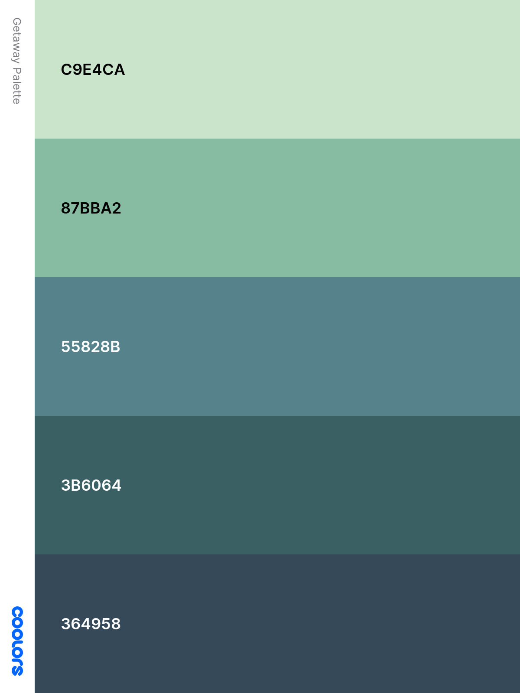

# Wild Getaway
Book your Wild Get Away! Take some time out and embrace nature, stay in one of our luxury Camping Pods and get away for a short break in the wild.
On this site you can find all the information you need to make a booking and find relevant visitor information.

Thank you for visiting my project, if you have any questions or feedback please head over to my Github contacts and get in touch.

---
## Table of contents 

* [UX](#ux)
    * [Site Owners Goals](#site-owners-goals)
    * [User Goals](#user-goals)
    * [User Stories](#user-stories)
    * [User Requirements and Expectations](#user-requirements-and-expectations)
    * [Design Choices](#design-choices)
* [Wireframes](#wireframes)
* [Features](#features)
    * [Existing Features](#existing-features)
    * [Features to be implemented](#features-to-be-implemented)
* [Technologies used](#technologies-used)
* [Testing](#testing)
* [Bugs](#bugs)
* [Deployment](#deployment)
* [Credits](#credits)


---

## UX

### Site Owner Goals
* To advertise site and facilities available
* Relevant content about the holiday site
* Easy way for visitors to contact the holiday site
* Clear information on pricing and booking relevant policies for stays
* Appealing visual elements
* links to review sites and social media to engage with audience
* link for email sign up

[Back to Top](#table-of-contents)

### User Goals
* Website should be easy to use on desktop, tablet and mobile
* Website is filled with valuable/ relevant content
* Contact details are easy to find
* Pricing and policies are clear and easy to find
* Form to contact owners directly from Website
* creative calls to action
* Form to sign up for updates from site
* Social reviews- testimonials and links to social media
* Information about the holiday site, what to expect upon arrival, facilities available

### User Stories

* As a user, I want to be able to easily access contact information for the holiday site
* As a user, I want to be able to contact the site directly from the website
* As a user, I want to be able to easily find the information for booking a stay
* As a user, I want to find the information about check in and check out policies
* As a user, I want images of the accommodation and site
* As a user, I want information about access and parking facilities
* As a user, I want to see review and testimonials for the site
* As a user, I want the website to be easy to navigate and simple to use
* As a user, I want the website to be easy to use on tablets
* As a user, I want the website to be intuitive to make booking easy
* As a user, I want the website to be emotionally engaging to make me want to stay there
* As a user, I want clear information about the facilities available and what I need to provide for myself
* As a user, I want to know about the local landscape and wildlife that I may see during my stay
* As a user, I want there to be social media links that open in a access page

[Back to Top](#table-of-contents)

### User Requirements and Expectations
#### Requirements
  * Easy to navigate using the navigation menu 
  * Relevant information about holiday site
  * Easy way to contact site
  * Visually appealing elements
  * Clear concise information about prices and policies

#### Expectations
  * When clicking on external links the page will open in a sperate browser window
  * Expect that navigation links work correctly and go where they are supposed to
  * Clear information about location and facilities
  * Website works in line with the customer journey
  * Feedback is provided that forms have been entered and completed correctly

[Back to Top](#table-of-contents)

---

### Design Choices
* Overview

   As this site is for a Pod campsite in a rural location the colour scheme and visuals have been chosen to reflect a more natural palette, keeping a more rustic aesthetic.  

* Fonts

   To choose the appropriate fonts for this project I visited [Google Fonts](https://fonts.google.com/) and browsed the various fonts available.
   for the main content of the page I chose [Lato](https://fonts.google.com/?sort=popularity&preview.text=Wild%20Getaway!&preview.text_type=custom&sidebar.open=true&selection.family=Amatic+SC:wght@400;700&query=lato)
   as it is a clear and easy to read font, making the page easily accessible for users. I chose [Amatic SC](https://fonts.google.com/specimen/Amatic+SC?sort=popularity&category=Handwriting&preview.text=Wild%20Getaway!&preview.text_type=custom&sidebar.open=true&selection.family=Amatic+SC:wght@400;700)
   for the titles and subtitles as it is a handwriting style font to give the page a more natural feel and to add a more personal touch.   

* Icons

   I used icons from the [Font Awesome library](https://fontawesome.com/ "Font Awesome") the icons I chose are inline with the over all feel for the site and are general industry standard.
   The icons have been selected so as not to stand out from the site but to add to the overall ease of use for the user enabling intuitive navigation.
   
* Colours

   The colour scheme has been chosen to reflect the natural environment that the Pod campsite is situated in, the chosen colours can be view below.   
   Below I will explain why each colour was chosen and what they will be used for.   



  * #364958 will be used for the header and footer elements this charcoal color has been chosen to represent the night sky as the Pod site is situated within an international dark sky reserve.
  * #3B6064 will be used as the main back ground color for the website. This dark teal color has been chosen to represent the forests that are local to the holiday site.
  * #87BBA2 will be used for the call to action buttons on the website as well as the contact form, this light green tone has been selected for its closeness to the moorland grasses in the local landscape.
  * #C9E4CA text color
  * #55828B additional background color


[Back to Top](#table-of-contents)

### Wireframes

   I decided to use [Balamiq Wireframes](https://balsamiq.com/) to create my wireframes, starting with a basic wireframe for the desktop, them moved 
   on to the tablet and mobile wireframes, to get and idea of how I wanted the layout to work at different media points. I decided to utilise a one page
   website for this project as this is widely used in the tourism industry for ease of use for the user. The website will also use a navigation bar to
   make quick access available for users looking for particular information rather than having to scroll every time.

   Wireframes can be view on the following links:

[Desktop Wireframe](wireframes/wild-getaway-desktop.png)

[Tablet Wireframe](wireframes/wild-getaway-tablet.png)

[Mobile Wireframe](wireframes/wild-getaway-mobile.png)

[Back to Top](#table-of-contents)

---

### Features 

#### Existing Features

##### Navigation Bar

   I used Bootstrap to implement a navbar which was fixed to the top of the screen, the links all work to quickly direct users to
    different elements of the webpage so that they can find the information that they are looking for without scrolling through the whole of the page.

##### Welcome Section

   In this section I wanted the user to get a quick introduction to what "Wild Getaways" had to offer, for this the mobile version has a plain background whilst on larger screen sizes there is a 
   background image. This is a design decision as on a mobile screen it looked too cluttered, so keeping the background plain on a smaller screen size kept the user experience cleaner.

##### Prices Section

   For the Prices section I used a Bootstrap grid of 3 columns on larger screens and allowing them to be full screen in mobile view. Below the 3 column row I used Bootstrap to add an offset column 
   with the checkout information in so that it was centralised on larger screen sizes helping the page to flow for good user experience.

##### Facilities Section

   The Facilities section also utilised Bootstraps 3 column grid on larger screen sizes with images of the holiday size on each side of list of the facilities available to guests staying on the site. 
   This three column grid moves to full width on mobile view.

##### Reviews Section

   The reviews section uses Bootstrap grid with 2 columns in each row on larger screen sizes, expanding to full width on mobile view to prevent crowding. I n this sectio I also used fontawesome for the social media icons and 
   comment bubbles, all of which are widely used in the industry and help reduce the amount of text needed to convey the message to users.

##### Local wildlife

   This section contains two images that I used Bootstrap to centralise so that on larger screen sizes the flow of the site was maintained whilst on mobile view they take up the whole screen.
   The images sandwich the text that helps users understand what the local wildlife is like and when the best time of the year is to visit for different types.

##### Contact Section

   This section utilises Bootstrap for both the grid, to ensure a uniform appearance for the site, but also for the form element. The upper part of this section has the address and telephone details and below this is the form 
   element where the user can fill in their details so that Wild Getaways can respond to their query directly.

#### Features to be implemented

* An interactive map of the location with a link to google maps.
* Direct booking functionality to increase booking numbers.
* Links to external partners such as local restaurants, cafes, museums and local shops.
* A section with downloadable maps of walks from the site as well as walks and bike rides locally.
* Relevant GDPR information.

[Back to Top](#table-of-contents)

---

### Technologies used
#### Languages

* HTML
* CSS
* jquery

#### Libraries & Frameworks
* [Font Awesome](https://fontawesome.com/)
* [Google Fonts](https://fonts.google.com/)
* [Bootstrap](https://getbootstrap.com/)

#### Technologies

* Git
* [GitPod] (https://github.com/)
* Balsamiq
* W3C HTML Validation Service
* W3C CSS Validation Service

[Back to Top](#table-of-contents)

---

### Testing

#### Site Navigation
   __User Story: As a user, I want to be able to easily access contact information for the holiday site__

   __User Story: As a user, I want to be able to contact the site directly from the website__

  * Plan

     To make the contact information for the information for the holiday site accessible through a section within the webpage and quickly accessible to the user
     through a link in the fixed navigation panel. Within this section there will be a form where the user can send a message directly to the holiday site with their 
     query.

  * Implementation

     I have created a section on the webpage for the user to find the contact information for the holiday site, including the address and telephone number.
     within this section I added a form element that is made up of two required fields for their name and email as well as a text are for the user to express their query to 
     be submmited directly to the holiday site.
  
     The contact section of the web page has a link in the navbar (which was implemented from Bootstrap) of the site so that the user can quickly access this are of the webpage.

  * Test

     To test that the contact section was easily accessible from the navbar I tested the links to ensure that it was working correctly.

  * Result

     The navbar links all work and take the user to the section that they need.

  * Verdict

     The navbar functions correctly meaning that the user can quickly find the contact information, in this section they can also use the form to directly contact the camp site with their query.
     As such the user can quickly find contact information with the option of submitting a query on the site or using the phone number provided to call with any questions. 

   __User Story: I want to see review and testimonials for the site__

   __User Story: I want there to be social media links that open in a access page__

* Plan

   Reviews are an essential part to helping users understand what the camp site as to offer so in this section there will be a small number of reviews from previous guests visible directly on the webpage 
   then there will be social media links to public review sites such as Trip Advisor and Facebook where the users can undertake further research if they require.

* Implementation

   I created this section of the website with Bootstrap to create a grid containing four testimonials from previous guests. I then made a row with the social media links using icons from fontawesome as is industry standard 
   and ensured that these links opened in a new window so that the user doesn't loose the site.

* Test

   I tested that all the external links worked as required opening in a new window, I tested this on chrome, mozilla and safari to check that this function worked in different browsers.

* Result

   All the links opened in new windows meaning that returning to the web page is easy for the user.

* Verdict

   The external links work as  expected and are easy for the user, the review section also mean that there are testimonials on the page for users to refer to, as well as external links to read different peoples reviews.

   __User Story: I want clear information about the site facilities available and what I need to provide for myself__

* Plan

  To create a section that lists the facilities available to guest on site and has inviting images to help them visualise their stay.

* Implementation

   I used Bootstrap to create a grid layout with three columns the two outer can be used for the images that highlight the look and feel of the site,
   then the centre column hold the list of facilities. Underneath these there is information about arrival and departure times, clearly visible 
   for users, this is important when planning travel times for arrival and departure.

* Test

   All elements are clearly visible on all screen sizes, the layout changes for mobile view with images and text stacking rather than appearing side by side 
   this ensures that the images and text don't end up cramped and negatively impacting UX.

* Result

   All elements are clearly visible on all screen sizes, the layout changes for mobile view with images and text stacking rather than appearing side by side 
   this ensures that the images and text don't end up cramped and negatively impacting UX.

* Verdict

   All elements work as expected and are quickly accessible for the user.

[Back to Top](#table-of-contents)

---
### Bugs

#### Hero image

   When initially designing the website I had intended for all screen sizes to use a hero image in the background of the welcome section, during the trialling of the page I found that the background image 
   whilst visually appealing on tablets and laptop screens was too busy for a mobile screen. This detracted from the UX, as such a media query was added that means that the background is kept clean 
   on small screen sizes and the hero image is only visible on tablet and laptops where it retains its appeal and add to the feel of the webpage.

#### Contact Form

   I initially made the contact form using two rows which led to it behaving in ways that would have been confusing to the user it also meant that the rows were slightly out of line with each other and looked 
   messy on all screen sizes. After a chat with my mentor I realised my error and re-made the from using one row and leading to a much tidier end product.

[Back to Top](#table-of-contents)

---

### Deployment

This project was deployed via GitHub by executing the following steps.
After writing the code, committing and pushing it to GitHub:
* Navigate to the repository on github and click **Settings**.
* From there, go to the **Source section** within the Github Pages section.
* Select **master branch** on the dropdown menu, and click save.
* Now the website is live on:
```
https://yourgithubusername.github.io/your-repo-name
```
* Any time commits and pushes are sent to Github, the Github Pages site should update shortly after.
### **To run the project locally:**
1. Click the **green Clone or Download button** on the Github Repository
1. Using the **Clone with HTTPS option**, copy the link displayed.
1. Open your IDE, and ensure the Git Terminal is open.
1. Change the working directory to the location where the cloned directory is to go.
1. Use the **"git clone" command** and paste the url copied in the second step.


[Back to Top](#table-of-contents)

---

### Credits

  * Photos used in this site were sourced from [iStockphoto](https://www.istockphoto.com/) to ensure that no copyrights were breached.

  * I would like to thank Simen [Eventyret_mentor](https://github.com/Eventyret) for his help and support during this project- my first attemt at writting code and building a webpage. He has helped me build confidnce in myself that 
  I will learn to be a better coder through making mistakes and learning from them.
  *  I aslo want to thank my family for testing and spell checking, proofing and generally putting up with me!

[Back to Top](#table-of-contents)
