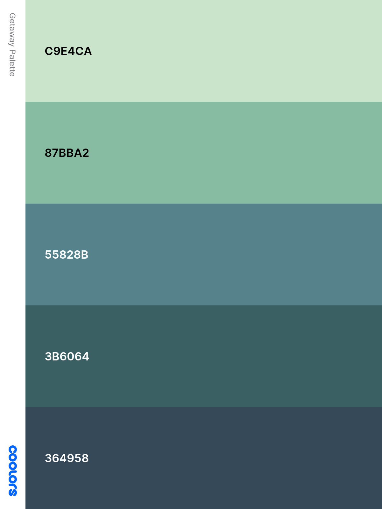

# Wild Getaway
Book your Wild Get Away! Take some time out and embrace nature, stay in one of our luxury Camping Pods and get away for a short break in the wild.
On this site you can find all the information you need to make a booking and find relevent visitor information.

Thank you for visiting my project, if you have ant questions or feedback please head over to my Github contacts and get in touch.

---
## Table of contents 

* [UX](#ux)
    * [Site Owners Goals](#site-owners-goals)
    * [User Goals](#user-goals)
    * [User Stories](#user-stories)
    * [User Requirements and Expectations](#user-requirements-and-expectations)
    * [Design Choices](#design-choices)
* [Wireframes](#wireframes)
* [Features](#features)
    * [Existing Features](#existing-features)
    * [Features to be implemented](#features-to-be-implemented)
* [Technologies used](#technologies-used)
    * [Languages](#languages)
    * [Tools and Libraries](#tools-and-libraries)
* [Testing](#testing)
* [Deployment](#deployment)
* [Credits](#credits)

---

## UX

### Site Owner Goals
* To advertise site and facilities available
* Relevent content about the holiday site
* Easy way for visitors to contact the holiday site
* Clear information on pricing and booking relevent policies for stays
* Appealing visiual elements
* links to review sites and social media to engage with audience
* link for email sign up

[Back to Top](#table-of-contents)

### User Goals
* Website should be easy to use on desktop, tablet and mobile
* Website is filled with valuable/ relevnet contenet
* Contact details are easy to find
* Pricing and policies are clear and easy to find
* Form to contact owners directly from Website
* creative calls to action
* Form to sign up for updates from site
* Social reviews- testamonials and links to social media
* Information about the holiday site, what to expect upon arrival, facilities available

### User Stories

* As a user, I want to be able to easily access contact information for the holiday site
* As a user, I want to be able to contact the site directly from the website
* As a user, I want to be able to easily find the information for booking a stay
* As a user, I want to find the information about check in and check out policies
* As a user, I want images of the accomodation and site
* As a user, I want information about accesss and parking facilities
* As a user, I want to see review and testamonials for the site
* As a user, I want the website to be easy to navigate and simple to use
* As a user, I want the website to be easy to use on tablets
* As a user, I want the website to be intuitive to make booking easy
* As a user, I want the website to be emotionally engaging to make me want to stay there
* As a user, I want clear information about the facilities available and what I need to provide for myself
* As a user, I want to know about the local landscape and wildlife that I may see during my stay
* As a user, I want there to be social media links that open in a seperate page

[Back to Top](#table-of-contents)

### User Requirements and Expectations
* Requirements
  * Easy to navigate using the navigation menu 
  * Relevent information about holiday site
  * Easy way to contact site
  * Visually appealing elements
  * Clear concise information about prices and policies

* Expectations
  * When clicking on external links the page will open in a sperate browser window
  * Expect that navigation links work correctly and go where they are supposed to
  * Clear information about location and facilities
  * Website works in line with the customer journey
  * Feedback is provided that forms have been entered and completed correctly

[Back to Top](#table-of-contents)

### Design Choices
* Overview

   As this site is for a Pod campsite in a rural location the colour scheme and visuals have been chosen to reflect a more narual palette, keeping a more rustic aesthetic.  

* Fonts
   
* Icons
   I used icaon from the [Font Awesome library](https://fontawesome.com/ "Font Awesome") the icons I chose are inline with the over all feel for the site and are gneral industry standard.
   The icons have been selected so as not to stand out from the site but to add to the overall eas of use for the user enabling intuitve navigation.
   
* Colors

   The color scheme has been chosen to reflect the natural environment that the Pod campsite is situated in, the chosen colors can be view below.   
   Below I will explain why each color was chosen and what they will be used for.   

  * #364958 will be used for the header and footer elements this charcoal color has been chosen to represent the night sky as the Pod site is situated within an international dark sky reserve.
  * #3B6064 will be used as the main back ground color for the website. This dark teal color has been chosen to represent the forests that are local to the holiday site.
  * #87BBA2 will be used for the call to action buttons on the website as well as the contact form, this light green tone has been selected for its closenesss to the mpprland grasses in the local landscape.
  * #C9E4CA text color
  * #55828B additional background color

* Structure

[Back to Top](#table-of-contents)

### Wireframes

   I decided to use [Balamiq Wrieframes](https://balsamiq.com/) to create my wireframes, starting with a basic wireframe for the desktop, them moved 
   on to the tablet and mobile wireframes, to get and idea of how I wanted the layout to work at different media points. I decided to utilise a one page
   sebsite for this project as this is widely used in the tourism industry for ease of use for the user. The website will also use a navigation bar to
   make quick access available for users looking for particular information rather than having to scroll every time.

   Wireframes can be view on the following links:

[Desk Top Wireframe](wireframes/wild_getaway_desktop.png)

[Tablet Wireframe](wireframes/wild_getaway_tablet.png)

[Mobile Wireframe](wireframes/wild_getaway_mobile.png)

[Back to Top](#table-of-contents)

### Features 
* existing features  
* features to be implemented

[Back to Top](#table-of-contents)

### Technologies used
* languages
* libraries

[Back to Top](#table-of-contents)

### Testing

[Back to Top](#table-of-contents)

### Deployment

[Back to Top](#table-of-contents)

### Credits

[Back to Top](#table-of-contents)

